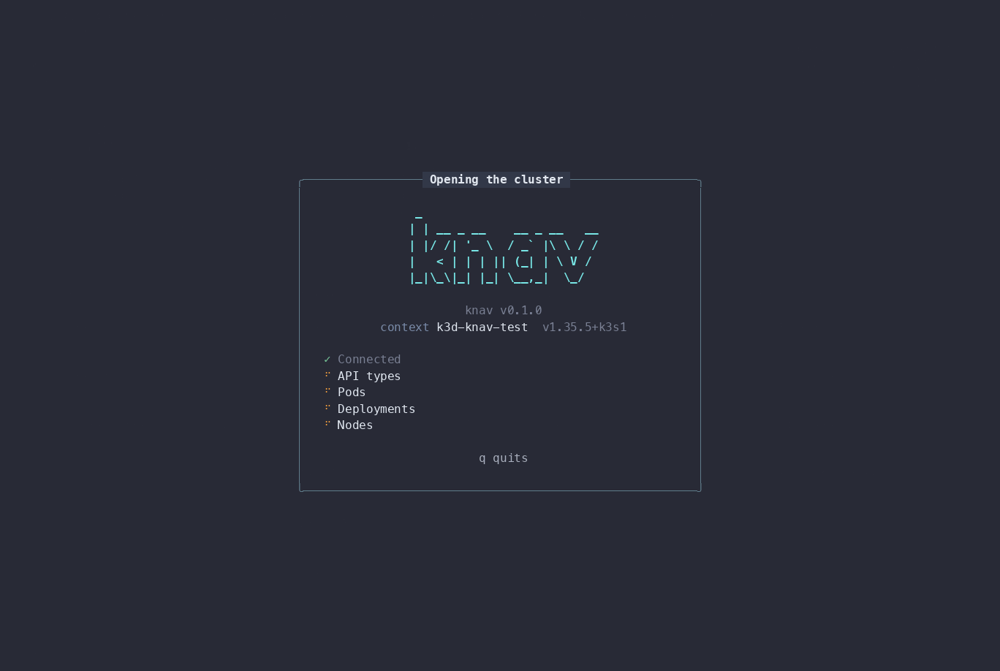
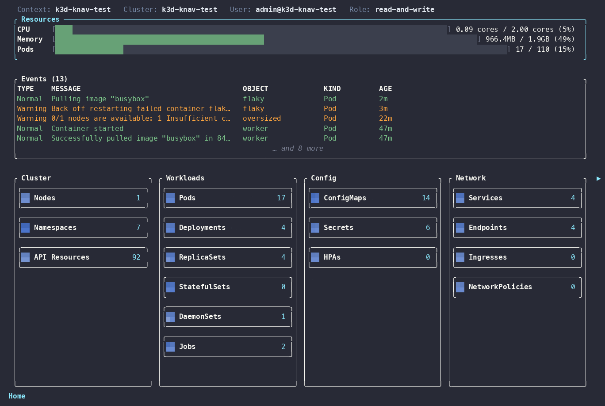
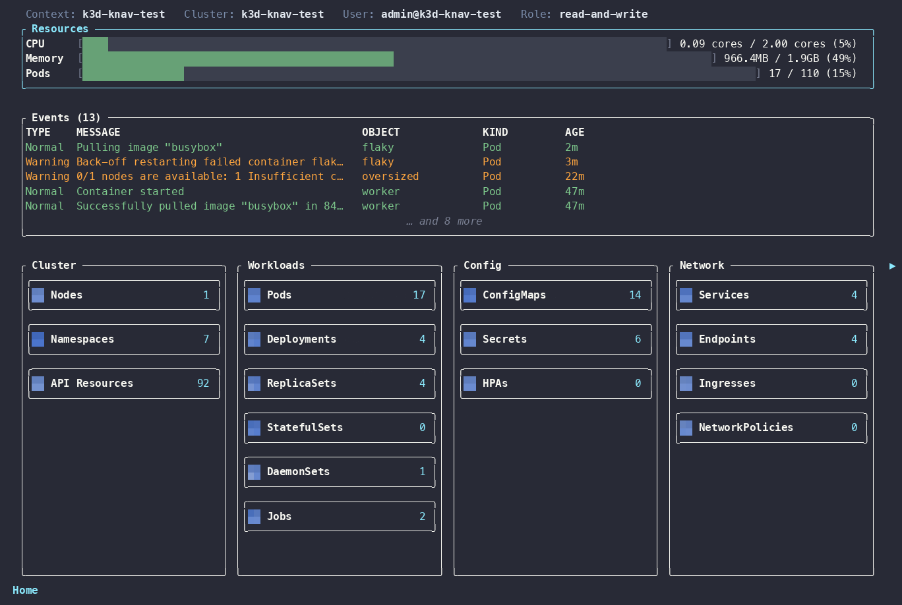
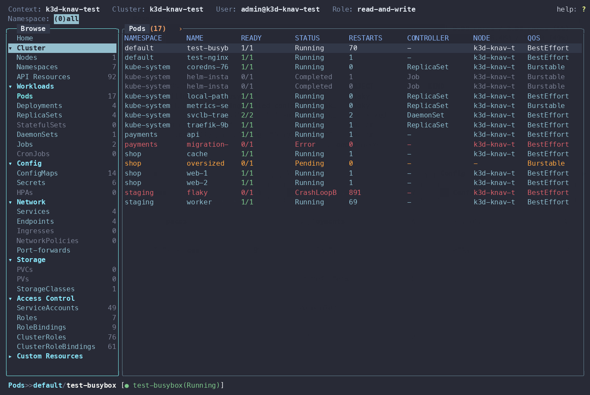
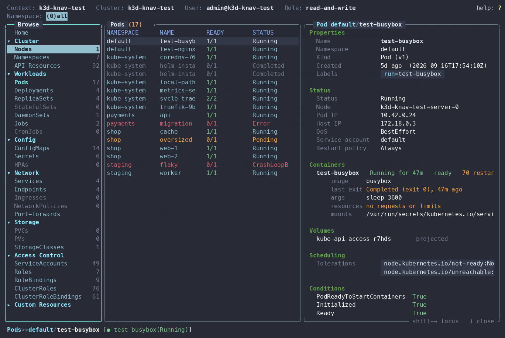
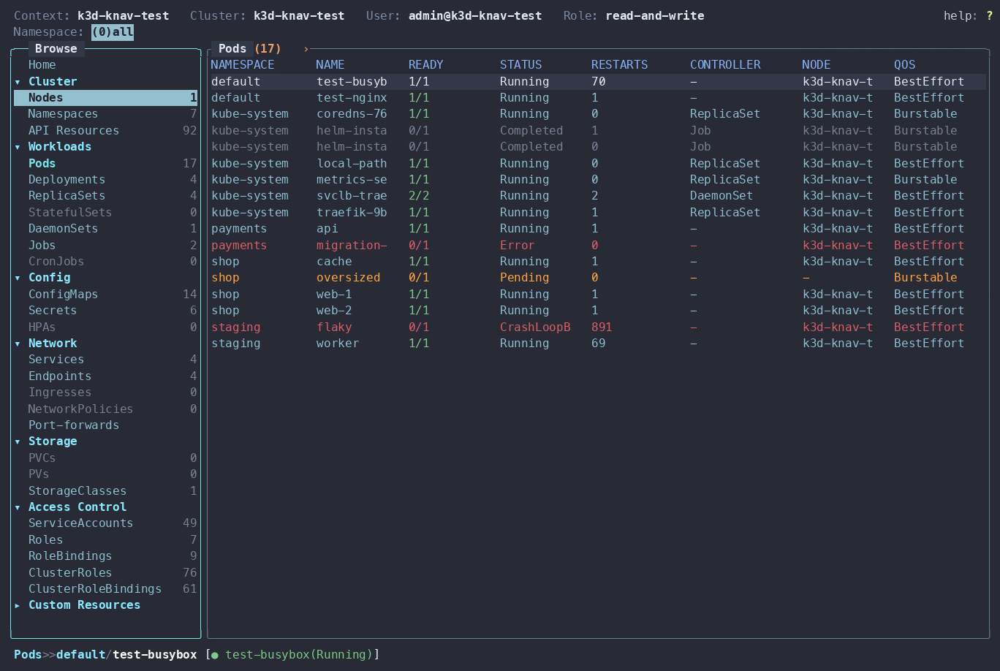
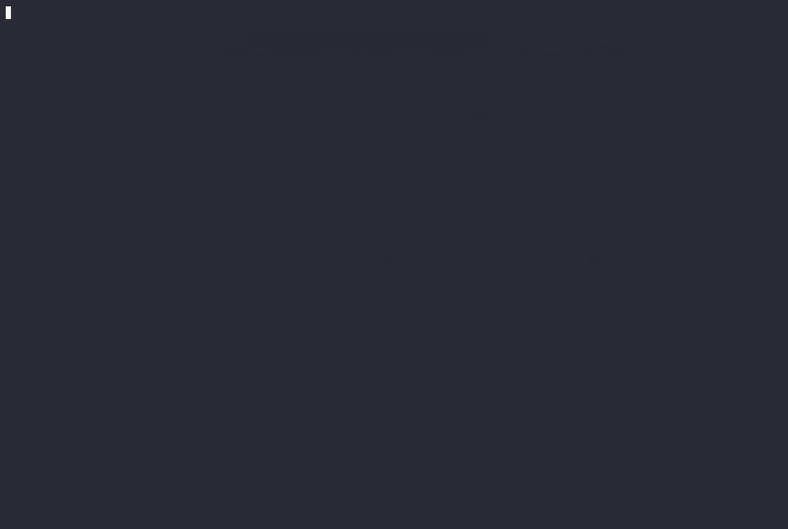

# knav

A fast, mouse-friendly Kubernetes TUI for big clusters: a browsable sidebar, an info panel that
explains any object, a diagram of what is related to what, and lists that stay live with tens of
thousands of objects. Think k9s with an IDE's explorer, built in Rust (`ratatui` and `kube-rs`).



## What it does

| | |
| --- | --- |
|  | **Home** shows cluster load, the latest events and every kind with its live count. `H` gets you back from anywhere. |
|  | **Browse sidebar** (`b` or `m`): every category and kind, custom resources included, with counts. `Shift-←` gives it the keys; `a` folds every category. |
|  | **Lists** with the columns you would get from `kubectl get -o wide`, sorted by any column (`s` then a digit, or `A` for age), searched with `/`, narrowed with `0`-`9` namespace keys. |
|  | **Info panel** (`i`): a readable summary that follows the selection: status, containers, volumes, conditions, events. Roles list their rules, Secrets are decoded. |
|  | **Related** (`R`): what provides to, and depends on, the selected object, as a diagram you can walk (`Space` follows, `m` copies it as Mermaid). |
|  | **API resources** (`:api`): every type the server has, with how many objects each holds, so a type is never opened blind. Any of them opens with the server's own columns. |

## Built for big clusters

Thousands of pods, hundreds of CRDs (Crossplane, Upbound), a cluster far away:

- The screen opens with a loading step list at once, while pods, deployments, nodes, events and
  API discovery all load side by side.
- Each watched kind is kept sorted with its rows built once; a watch event touches only its own
  entry. At 100k pods a change costs about 0.02 ms, a search 8 ms and a sort 3 ms.
- Discovery is two requests, not one per API group; custom resources come from a paged name list.
- Type lists follow a watch instead of being read again every few seconds, and object counts are
  fetched only for the types on screen.
- Anything slow (a delete, a shell, fetching a big object) runs in the background, never freezing the UI.

## Install

There are no packages yet, so build it (Rust 1.85 or newer):

```
git clone https://github.com/guilhermemcandido/knav
cd knav
cargo install --path .
knav                      # uses your current kubeconfig context
knav -c prod              # fuzzy-matches a context by name
```

It needs a kubeconfig with access to a cluster. `kubectl` is only needed for port-forwards and the
shell (`F`, `S` on a pod).

## Try it

```
:pods            open a list (any resource the cluster serves: :svc, :leases, a custom resource...)
/text            filter the list (fuzzy)
i                the info panel of the selected row
R                what is related to it
l                its logs (p: the previous run's)
y                the YAML;  e  edit it in $EDITOR;  D  delete (asks first)
:api             every resource type, with counts
b                the sidebar
?                every key for the screen you are on
```

## Keys

Press `?` on any screen for the keys that apply there. The common ones:

| Key | Does |
| --- | --- |
| `:` | Command line (`> `): any resource the cluster serves (`pods`, `rs`, `svc`, `flowschemas`, `leases`, a custom resource, ...), `api`, `ctx`, `events`, `q` |
| `:api` | Every resource type the API server lists; `Enter` opens one with the server's own columns (what `kubectl get` prints) |
| `b` (or `m`) | Browse: show or hide the resource sidebar: Home and every category with its kinds (CRDs included) and live counts, like an IDE's explorer. `Shift-←` gives it the keys (`jk` move, `Enter` opens a kind or folds a category, `h`/`l` fold and unfold, `Esc` or `Shift-→` returns to the list; `g`/`G` go to the top and bottom and `a` folds or unfolds every category); clicks work too. Needs a terminal of 90 columns or more |
| `n` | Namespace picker; `Enter` picks one and asks which number key (1-9) to keep it on |
| `0`-`9` | Switch namespace: `0` is all, `1`-`9` the ones you reserved (kept per context) |
| `Enter` | Drill into what a row owns (Deployment → ReplicaSets → Pods → containers → logs), or open its spec |
| `/` | Search the list; matches are highlighted |
| `A` | Sort by age (again flips the direction, then clears it) |
| `s` then a digit | Sort by that column (columns are numbered from 0); the same digit flips the direction. `←`/`→` (or `h`/`l`) move a cursor along the headers, scrolling to it, and `Enter` sorts by that column, so any column can be sorted, not just the first ten. `s`/`Esc`/`q` leaves |
| `←` `→` | Scroll columns sideways when they don't fit |
| `g` `G` / `Ctrl-f` `Ctrl-b` | Top or bottom of the list / page down or up (also `Home` `End` `PageUp` `PageDown`) |
| `y` / `Y` | The manifest as YAML text (`c` there copies it) / copy the row's `namespace/name` to the clipboard |
| `O` | Jump to the owner (pod → ReplicaSet → Deployment), or click a pod's CONTROLLER; `Esc` comes back |
| `i` | Info panel beside the list (like a desktop client's drawer): a readable summary of the selected object (name, namespace, labels, status, containers with image, ports and resources, conditions, events; Roles list their rules and verbs, bindings their subjects, and NetworkPolicies, quotas, StorageClasses, ServiceAccounts, CRDs and more have their own sections) that follows the selection. `Ctrl-d` / `Ctrl-u` or the wheel over it scroll, or press `Shift-→` to give it the keys (`↑↓` `jk` `g`/`G` and the page keys scroll down, `←→` `hl` scroll sideways to read long values) `Enter` there opens it full screen, and `Shift-←` or `Esc` goes back to the list; a Secret's text values are decoded here; `x` hides or shows them (shown again when the object changes), `i` closes. On terminals under 100 columns it opens full screen instead, and `y` there switches to the YAML |
| `R` | Related objects as a diagram: arrows run from what provides to what depends (node → pod, config map → pod, deployment → replica set → pod), callers, owners and what it uses on the left, the object in the middle, what it owns or what uses it on the right. Arrows or `hjkl` move between boxes, `Enter` opens that object in its list, `Space` follows the map to it (recentres), `Backspace` goes back, `m` copies the diagram as Mermaid text, clicks select a box (double click shows its info), `Esc` closes |
| `[` `]` `-` | View history back, forward, and the view before this one |
| `Ctrl-z` | List only the rows that need a look (broken or unready) |
| `Ctrl-w` | Wide columns: IP and images for pods, address/OS/kernel/runtime for nodes, images for deployments, labels for the rest |
| `Space` | Mark the row and move down; `D`, `r` and `S` then act on every marked row. `Esc` clears the marks |
| `d` / `e` | Show the spec / edit the manifest in `$EDITOR` |
| `l` / `p` | Logs of a pod's container / the previous run's (in the containers popup too) |
| `F` | Port-forward a pod, service or deployment (a dialog with container port, local port and address; warns when the port is not declared); opens the browser; `:pf` is the list of forwards (`Enter`/`o` open one, `D` stops it). Needs `kubectl` |
| `x` | Show a Secret's values decoded |
| `D` | Delete the selected object (asks first) |
| `S` | On a Deployment, StatefulSet or ReplicaSet: scale (type the count). On a pod: a shell in its container, inside knav (`Ctrl-]` closes it; every other key goes to the shell). Needs `kubectl` |
| `r` | Restart a Deployment, StatefulSet or DaemonSet (asks first) |
| `c` | Cordon or uncordon a node |
| `t` / `u` | Trigger a CronJob now / suspend or resume it (both ask first) |
| `C` | Switch context |
| `T` / `:theme` | Pick a theme; each one previews live as you move, `Enter` keeps it |
| `,` / `:config` | The settings screen: every option, colours and key bindings included |
| `H` | Home (the start screen) from anywhere; `:home` works too |
| `Q` / `:q` | Quit (a stray `q` never does) |

The mouse works too (hold Shift, or Option in iTerm2, to select text with the terminal): the wheel moves the selection in every list and popup, a click
selects a row, a double-click opens it, and clicking a tile on Home selects it.

The bottom bar shows where you are (`Deployment[web]>>ReplicaSets>>...`) and
the selected row's status, with a green or yellow dot for ready counts.

## Config

`$XDG_CONFIG_HOME/knav/config.toml` (default `~/.config/knav/config.toml`). Every
field is optional.

```toml
[startup]
mode = "direct"          # or "menu": always show the context picker first

[logs]
order = "oldest_first"   # or "newest_first"; `o` toggles it in the log view
timestamp_format = "short" # or "full"; `t` toggles it

[keybindings.logs]
toggle_timestamp = "t"
toggle_order = "o"

[ui]
border = "rounded"   # box lines: rounded, thick or double
suggestion_icon_percent = 78

[mouse]
wheel_rows = 3
double_click_ms = 400

[api]
refresh_seconds = 2

[tables]
min_column_width = 10    # no column is squeezed below this; wider tables scroll sideways
[tables.min_widths]      # per column, keyed by the lowercase header
name = 24
"up-to-date" = 12
```

```toml
[portforward]
open_browser = true      # false: ask "Open ... in the browser?" instead
```

## Themes

`T` (or `:theme`) lists the themes; moving through the list previews each one on the whole
interface, `Enter` keeps it and `Esc` goes back. Built in: `knav`, `k9s`, `high-contrast`, `mono`,
`dracula`, `nord`, `gruvbox-dark`, `gruvbox-light`, `catppuccin-mocha`, `catppuccin-latte`,
`tokyo-night`, `one-dark`, `monokai`, `solarized-dark`, `solarized-light`, `rose-pine`, `everforest`
and `github-dark`. The palette themes paint their own background.

Your own themes are files in `~/.config/knav/themes/<name>.toml` and show up in the list:

```toml
base = "dracula"          # optional: start from a built-in or another of yours
[colors]                  # or put the roles at the top of the file
ok = "#50fa7b"
select_bg = "#44475a"
```

Colours are `#rrggbb`, a terminal colour name (`red`, `darkgray`, ...) or `indexed:N`. Pick a
theme with `T`; to tweak single roles, set them in the config:

```toml
[theme]
preset = "dracula"
[theme.colors]            # overrides on top of the preset
warn = "#ffb86c"
```

## Settings screen

`,` or `:config` opens every setting in one list, grouped by section: theme, box lines, table
columns, logs, mouse, behaviour and keys. The selected setting is explained under the list. `←` `→`
(or `Enter`) change a value, `Enter` types a number, and on a key it opens a popup where you press
the new key and confirm. `r` resets one to its default. Changes save to `config.toml` (your
comments and other settings stay) and apply at once, except the few marked "restart to apply".

The settings screen has three tabs, switched with `Tab` / `Shift-Tab` or a click: **General**,
**Keys** and **Layout**. The last one reorders and hides categories and kinds, for both Home (the start screen) and the Browse sidebar: `K` / `J` (or `Shift` with the
arrows) move a category or a kind up and down, `Space` hides or shows it, `r` restores the default.
Kinds stay inside their category. In the file:

```toml
[overview]
sections = ["Workloads", "Cluster"]          # categories first, the rest keep their order
hidden = ["Config/Secrets", "Storage"]       # a kind, or a whole category
[overview.items]
Workloads = ["Pods", "Jobs"]                 # kinds first within a category
```

## Key bindings

Every action can be rebound under `[keys]`, as one key or a list. Keys are `j`, `D` (shift-d),
`ctrl-z`, `alt-x`, `enter`, `esc`, `space`, `tab`, `up`, `down`, `f5`, ... The digits are reserved
for the namespace and sort shortcuts, and text entry and the mouse are fixed.

```toml
[keys]
delete = "X"
move_down = ["j", "down", "ctrl-n"]
help = "f1"
```

Two actions that can be used on the same screen can't share a key: the settings screen refuses
with a message naming the other action, and in the file the later one is ignored (with a warning
when knav starts). Swapping two actions' keys is fine. The action names and their keys are all in
the settings screen under "Keys". The help screen and the hints follow whatever you bind.

Reserved namespaces are saved in `~/.config/knav/namespaces`.

## Layout of the code

- `src/k8s/`: talking to the API and shaping objects into rows (one module per concern; `kept` keeps each watched kind sorted with its rows, updated per watch event)
- `src/describe.rs`: the per-kind columns and their colours
- `src/app/`: the event loop: `state` (what's on screen), `derive` (rows per frame), `draw`, `handlers/` (input per screen)
- `src/ui/`: rendering: `layout` (column widths and scrolling), `tables`, popups, header, breadcrumb
- `src/mode.rs`, `src/sort.rs`, `src/scope.rs`, `src/commands.rs`: screens, sorting, drill-down scope, the command line
