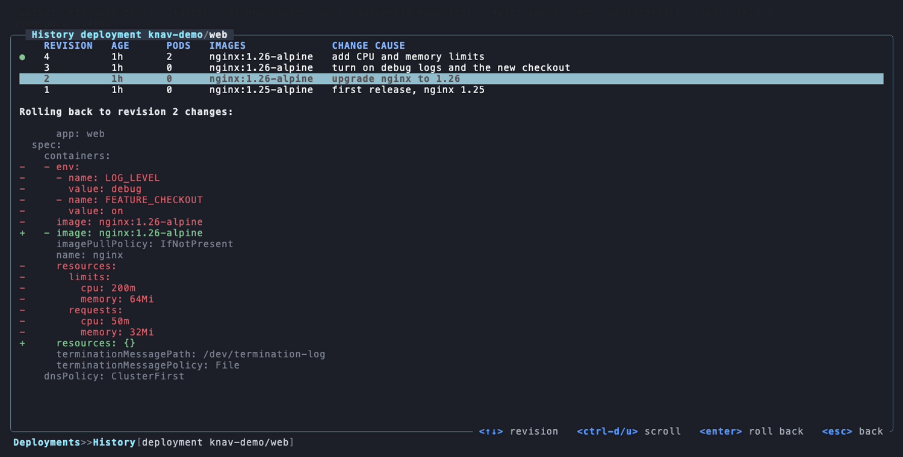
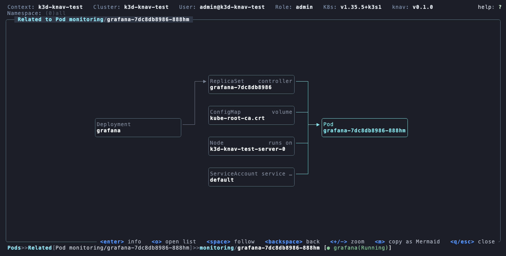
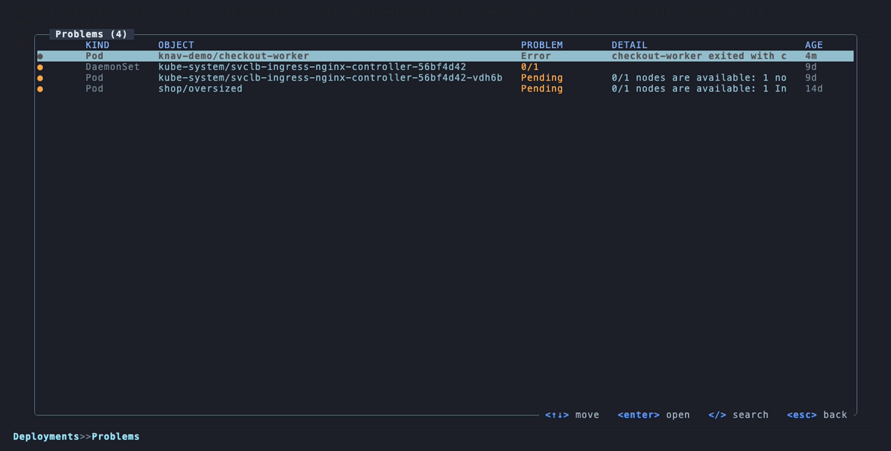
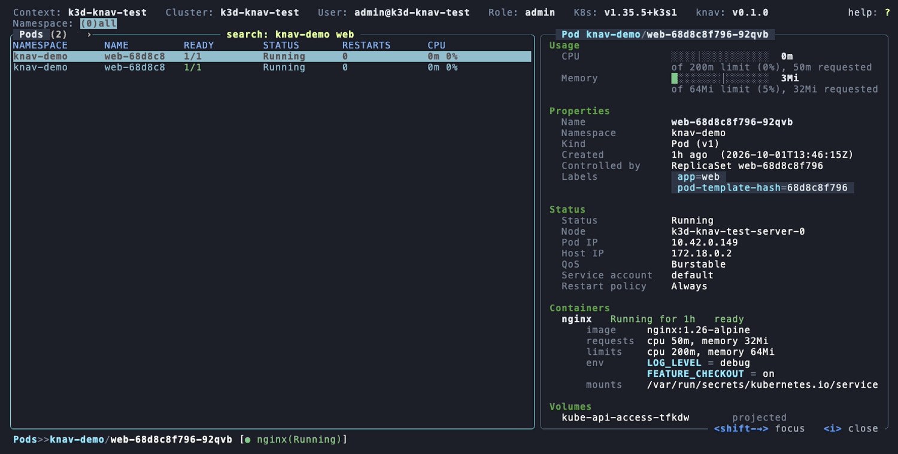
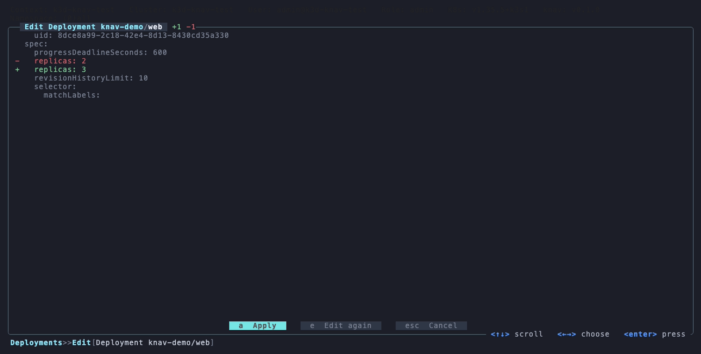
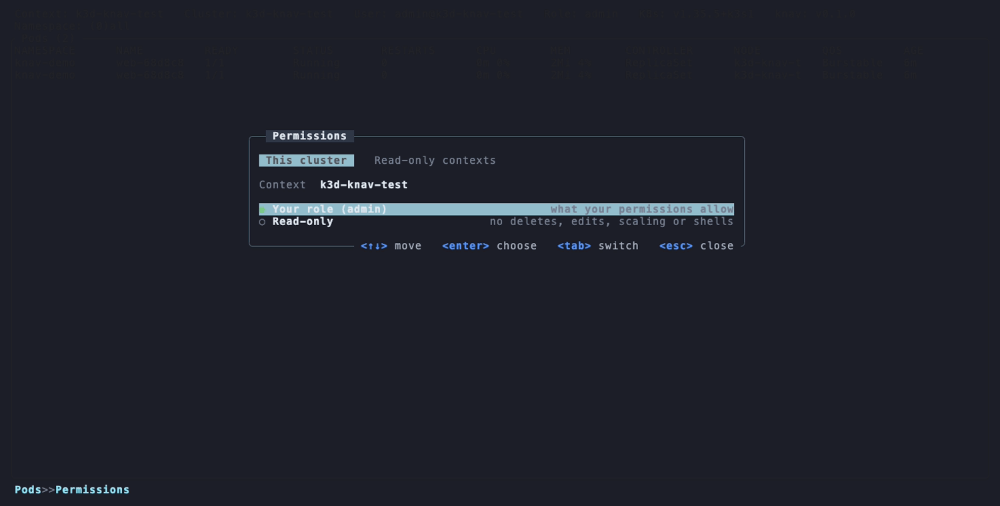

# knav

A high performance, mouse-friendly TUI to explore and debug Kubernetes clusters,
built in Rust. Think k9s with an IDE's explorer.


- **Sidebar** of every kind, custom resources included, with live counts.
- **Info panel** (`i`) explains the selected object: status, containers, events.
- **Relations diagram** (`R`) shows what an object depends on and what depends on it.
- **Extensions** (`E`) add views and dashboards for Flux, Argo CD, cert-manager and more. Read-only.
- **Problems** (`!`) lists everything that needs a look across the cluster, with the reason.
- **CPU and memory** per pod, against its limits.
- **Rollout history** (`v`) compares the revisions of a Deployment, StatefulSet or DaemonSet and rolls back.
- **Your own commands** on any key: `kubectl describe`, `stern`, anything with the selected object filled in.
- **Debug containers** (`X`) for pods without a shell, and logs saved to a file with `w`.
- **Knows your access**: the header shows your role (admin, read-write, read-only), checked against RBAC.
- **Built for scale**: stays fast with tens of thousands of objects.

## Take a look

### Rollout history (`v`)

Every revision a Deployment still has, with its images and change cause. Pick one to
see exactly what rolling back to it would change, then roll back with Enter. Here,
going back to revision 2 drops the debug env vars and the limits added since.



### Related objects (`R`)

The objects around the selected one: its controller and owner, the ConfigMaps and
Secrets it mounts, its node and service account. Move between boxes, open any of
them, or follow one to see what surrounds it next.



### Problems (`!`)

Everything that needs a look, across the cluster, worst first, each with the reason in
a word and the cluster's own explanation: why a container crashed, why a pod can't be
scheduled, which rollout is stuck. Enter jumps to it.



### Info panel (`i`)

What the selected object is doing, beside the list: usage against its requests and
limits, status, containers with their env and mounts, conditions and recent events.



### Review before applying an edit (`e`)

Edit in your `$EDITOR`, then see the change before it reaches the cluster: apply it,
edit again, or cancel. If the cluster refuses it, the reason shows on top and your
edit is kept.



### Permissions (`P`)

Per cluster, work with your own role or switch to read-only, which blocks deletes,
edits, scaling and shells. More tabs list the contexts that are always read-only, and
the ones whose header turns red so you notice where you are, by name or pattern like
`prod*`.



## Install

```
curl -fsSL https://raw.githubusercontent.com/guilhermemcandido/knav/main/install.sh | sh
```

Or from source (Rust 1.96+):

```
cargo install --git https://github.com/guilhermemcandido/knav
```

Needs a kubeconfig. `kubectl` is only used for port-forwards and shells.

## Use

```
knav              # current context
knav -c prod      # pick a context by name
knav --read-only  # block every change: delete, edit, scale, shells
knav update       # update to the latest release
```

Press `?` anywhere for the keys on that screen. The essentials:

| Key | Does |
| --- | --- |
| `:pods` | open any resource (`:svc`, a custom resource, ...) |
| `/` | search the list |
| `Enter` | drill in, from a Deployment down to a container's logs |
| `i` / `R` | info panel / related objects |
| `y` / `e` / `D` | YAML / edit / delete |
| `l` / `L` | a pod's logs / a whole workload's |
| `0`-`9` | switch to a reserved namespace |
| `!` | problems across the cluster |
| `v` | rollout history of a workload |
| `X` | a debug container in a pod |
| `P` | permissions: your role or read-only |
| `b` | sidebar |

## Config

Everything is set from the Settings screen (`,`) and saved to
`~/.config/knav/config.toml`, which you can also edit by hand:

- **General**: wide or faults-only lists on start, log order and timestamps, mouse, refresh rates
- **Appearance**: theme, box lines, icons (turn them off if your terminal can't draw images)
- **Behaviour**: start in the current context or a picker, read-only, port-forwards
- **Keys**: rebind any key
- **Layout**: which sections and tiles Home shows, and in what order

### Your own commands

Add them to `~/.config/knav/config.toml` (there is no Settings screen for these yet),
then restart knav. Each one runs on the selected object, from its key or by name on the
`:` line (`:describe`). `{kind}`, `{name}`, `{namespace}` and `{context}` are filled in
from the selection.

```toml
[[commands]]
name = "describe"
key = "ctrl-k"
read_only = true          # allowed in read-only mode
run = "kubectl describe {kind} {name} -n {namespace} --context {context}"

[[commands]]
name = "tail"
kinds = ["Deployment"]
output = "terminal"       # hand over the terminal; "view" shows the output, "background" a notice
run = "stern {name} -n {namespace} --context {context}"
```

Themes also switch live with `T`. Your own extensions go in `~/.config/knav/extensions/`.

## License

MIT or Apache-2.0.
