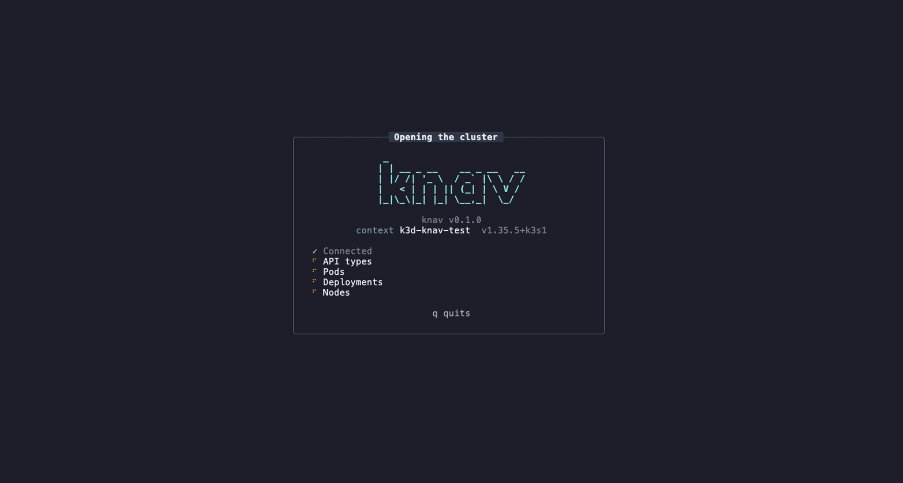

# knav

A fast, mouse-friendly Kubernetes TUI for big clusters. Think k9s with an IDE's
explorer, built in Rust.



- **Sidebar** of every kind, custom resources included, with live counts.
- **Info panel** (`i`) explains the selected object: status, containers, events.
- **Relations diagram** (`R`) shows what an object depends on and what depends on it.
- **Extensions** (`E`) add views and dashboards for Flux, Argo CD, cert-manager and more. Read-only.
- **Built for scale**: stays fast with tens of thousands of objects.

## Install

```
curl -fsSL https://raw.githubusercontent.com/guilhermemcandido/knav/main/install.sh | sh
```

Or from source (Rust 1.96+):

```
cargo install --git https://github.com/guilhermemcandido/knav
```

Needs a kubeconfig. `kubectl` is only used for port-forwards and shells.

## Use

```
knav            # current context
knav -c prod    # pick a context by name
knav update     # update to the latest release
```

Press `?` anywhere for the keys on that screen. The essentials:

| Key | Does |
| --- | --- |
| `:pods` | open any resource (`:svc`, a custom resource, ...) |
| `/` | search the list |
| `Enter` | drill in, from a Deployment down to a container's logs |
| `i` / `R` | info panel / related objects |
| `y` / `e` / `D` | YAML / edit / delete |
| `l` / `L` | a pod's logs / a whole workload's |
| `0`-`9` | switch to a reserved namespace |
| `b` | sidebar |

## Config

Optional, in `~/.config/knav/config.toml`. Themes, keys and layout can all be changed
from the Settings screen (`,`).

## License

MIT or Apache-2.0.
